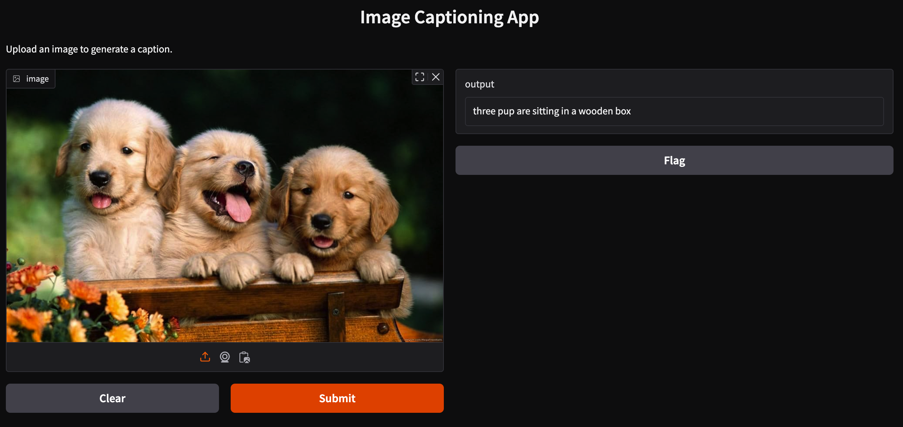

# Image Captioning App

## Overview
The Image Captioning App is a web-based application that generates captions for uploaded images. It uses the BLIP (Bootstrapped Language-Image Pre-training) model from Hugging Face Transformers to generate captions. The app is built with Gradio, providing an easy-to-use interface for users to upload images and receive captions.

## Features
- Upload an image and get a caption generated by the BLIP model.
- Simple and intuitive web interface powered by Gradio.
- Shareable link for easy access.

## Requirements
The following Python packages are required to run the application:
- `langchain==0.1.11`
- `gradio==5.23.2`
- `transformers==4.38.2`
- `bs4==0.0.2`
- `requests==2.31.0`
- `torch==2.2.1`

## Setup Instructions
1. Clone the repository:
   ```bash
   git clone <repository-url>
   cd image-captioning-app
   ```

2. Create a virtual environment and activate it:
   ```bash
   python3 -m venv my_env
   source my_env/bin/activate
   ```

3. Install the required dependencies:
   ```bash
   pip install -r requirements.txt
   ```

4. Run the application:
   ```bash
   python3 image_cap.py
   ```

5. Open the Gradio interface in your browser. The app will be hosted locally, and a shareable link will also be provided.

## Usage
1. Launch the application by running the `image_cap.py` script.
2. Upload an image using the Gradio interface.
3. View the generated caption displayed on the interface.

## Demo
Below is a demo of the Image Captioning App in action:



## License
This project is licensed under the MIT License. 

## Acknowledgments
- [Hugging Face Transformers](https://huggingface.co/transformers/)
- [Gradio](https://gradio.app/)